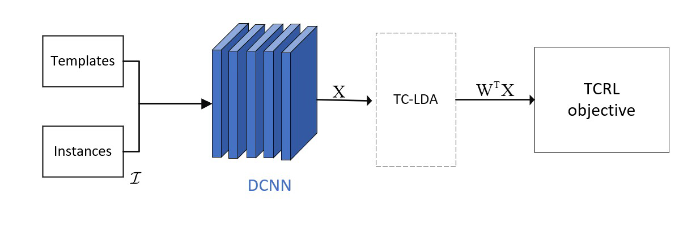
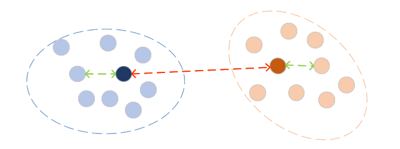

# DLDA

You can get paper at [paper](https://doi.org/10.1007/s11042-024-19589-8)

In this paper, we propose a template-centric representation learning (TCRL) framework that uses these standards as templates during recognition. 



We aim for the learning of the feature space to adhere to the following two principles: (i) Each instance of a class should cluster around its own template distribution, and (ii) it should be distant from other templates




## Requirements

* Python3
* PyTorch


## Run

run test.py

run CEE.py for cross-entropy loss

## Prepare the dataset
run divide.py for prepare dataset.
!the folder structure can be:

```
dataset 
├── template
├── val
├── test
└── train

```

